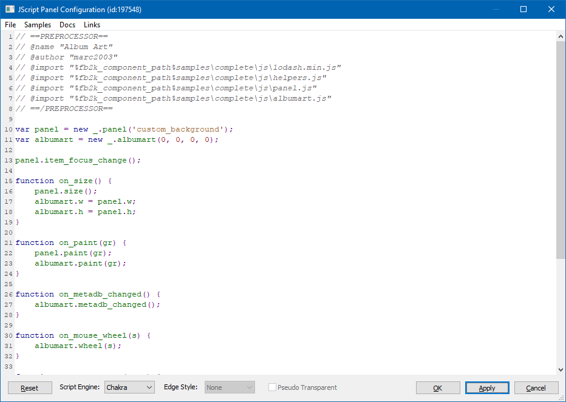

## Configuration Window

Right click any panel>`Configure` to open the `Configuration Window`.

- NOTE: Some scripts may implement their own menu without a `Configure` option. If this happens, you can hold down the `Shift` and `Win` keys and then right click. This always brings up the default menu.



## Keyboard shortcuts

```
Ctrl+F:   Open "Find" dialog
Ctrl+G:   Open "Go To Line" dialog
Ctrl+H:   Open "Replace" dialog
Ctrl+S:   Apply
F3:       Find Next
Shift+F3: Find Previous
```

## Main menu

You can use the `File` menu to `Import` and `Export` your scripts. The `Samples` menu provides quick access to all included scripts and the rest of the options should be self explanatory!

## Reset

Use this to reset back to the default script.

## Script Engine

When you have `IE9` or later installed, you can choose between using the `Chakra` engine which enables `ECMAScript5` features or the standard `JScript` engine which has `ECMAScript3` levels of support.

## Edge Style

This item is disabled when using `Default UI`. Since [foobar2000](https://foobar2000.org) `v1.4`, new splitter settings override individual panels.

For `Columns UI` users, there are 3 options: `None`, `Grey` and `Sunken`.

## Pseudo Transparent

This item is disabled in `Default UI` as it has no effect.

For `Columns UI` users, it's only usable when added as a toolbar or when contained within `Panel Stack splitter`.
