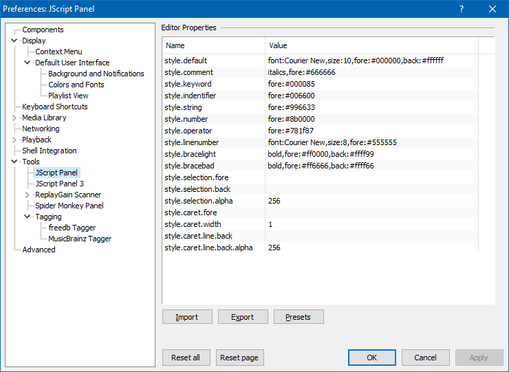

## Editor Properties

From `File>Preferences>Tools>JScript Panel` you can customise the fonts/colours used in the [Configuration Window](Configuration-Window.md).

As of `v2.2.0`, there is a `Presets` button which provides quick access to the themes that were previously bundled inside the component folder.
