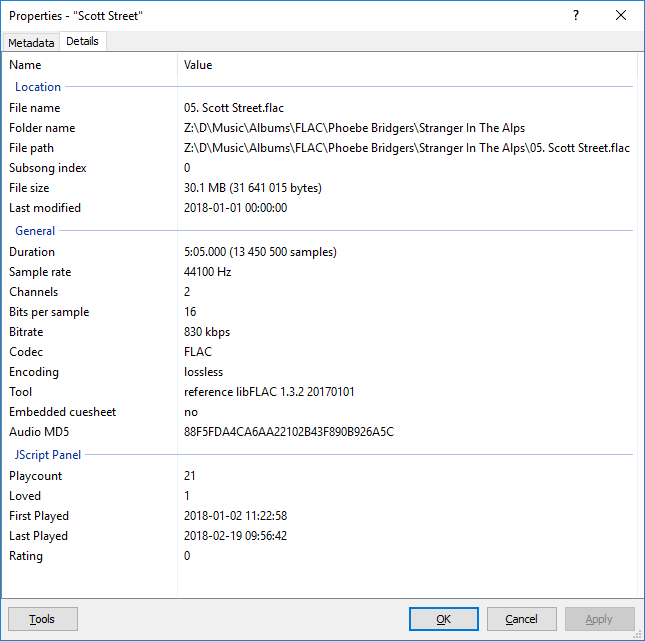
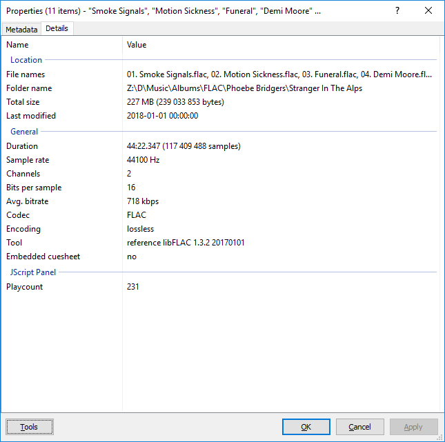

## Playback Stats

- This is a topic for intermediate/advanced users with a good understanding of how `JScript Panel` works with relation to `handles` and `handle lists`. The code snippets assume you're familiar with `callbacks` and how to implement your own buttons, menus, etc. For casual users, there are 2 complete scripts that make use of this database without requiring any script knowledge. See `Rating` and `Last.fm Lover` on the `Samples` menu in the [Configuration WIndow](Configuration-Window.md).

## Overview

A new way to store your own playback statistics has been added. Many may choose not to use it because of the limitations but since I've added it for myself, I might as well document it for anyone who does.

The main limitation is that playback stats are bound to `$lower(%artist% - %title%)`. This won't change so don't ask! It uses the same methods for storage as the [foo_playcount](https://www.foobar2000.org/components/view/foo_playcount) component meaning there should be no issue with large collections. The obvious benefits are being able to write any value you like directly and if you record plays in real time, you can set the time you have to listen to anything you like.

First of all, there are 5 fields available through title formatting in any component and search.

```
%jsp_playcount%
%jsp_loved%
%jsp_first_played%
%jsp_last_played%
%jsp_rating%
```

To write these values, 5 `handle` methods have been added.

```javascript
var handle = fb.GetFocusItem();
handle.SetPlayCount(12); // Must be a whole number, use 0 to clear.
handle.SetLoved(1); // Must be a whole number, use 0 to clear.
handle.SetFirstPlayed("2018-01-12 00:00:00"); // String, use "" to clear.
handle.SetLastPlayed("2018-01-12 00:00:00"); // String, use "" to clear.
handle.SetRating(5); // Must be a whole number, use 0 to clear. Max value can be 10, 20, 100 etc...
handle.ClearStats() // Should be obvious what this does!
```

You can of course store dates using any format you like. I just choose to use the same format as [foobar2000](https://foobar2000.org) uses so I can use them in time based [queries](http://wiki.hydrogenaud.io/index.php?title=Foobar2000:Query_syntax#Time_expressions).

After updating value(s) for a `handle`, you must use `RefreshStats` so the [foobar2000](https://foobar2000.org) core and all other components are made aware of the changes. There is a simple `handle` method for this.

```javascript
var handle = fb.GetFocusItem();
handle.SetRating(5);
handle.RefreshStats();
handle.Dispose();
```

If dealing with any kind of bulk operation updating many `handles` at once, you really should use the `handle list` alternative of `RefreshStats`. Using the `handle` method inside a loop could be very bad for performance. Instead, you should do something like this.

```javascript
var items = plman.GetPlaylistItems(plman.ActivePlaylist);
for (var i = 0; i < items.Count; i++) {
	items.Item(i).SetRating(5);
}
items.RefreshStats();
items.Dispose();
```

This triggers the `on_metadb_changed` callback within all `JScript Panel` instances and also `on_playback_edited` if the playing item was updated.

## Storage

All data is stored inside `index-data\835F0B63-D96C-447B-9CCB-714FA8304911` which will be inside your [foobar2000](https://foobar2000.org) profile folder. This filename is exclusive to this component. Any other files in this folder will belong to other components such as [foo_playcount](https://www.foobar2000.org/components/view/foo_playcount).

Like [foo_playcount](https://www.foobar2000.org/components/view/foo_playcount), data is remembered for up to 4 weeks when no matching track is part of the `Media Library` or any playlist.

## Example

Here's a crude example that updates as you play using the same rules as [Last.fm](https://last.fm) for the amount of time you have to play a track. Of course it can be modified in any way you like. This snippet requires a system with `IE9` or later for the `Date().toISOString` function. On a lesser system, you'd have to construct it yourself from the year, month, date, etc.

```javascript
var time_elapsed = 0;
var target_time = 0;

var tf_fp = fb.TitleFormat("%jsp_first_played%");
var tf_pc = fb.TitleFormat("$if2(%jsp_playcount%,0)");

function get_date() {
	// returns current time formatted like "2018-01-14 09:04:50"
	var d = new Date();
	var t = d.getTime();
	var offset = d.getTimezoneOffset() * 60 * 1000;
	var tmp = new Date(t - offset).toISOString();
	return tmp.substring(0, 10) + ' ' + tmp.substring(11, 19);
}

function on_playback_new_track() {
	time_elapsed = 0; //reset
	// this example uses the same rule as last.fm
	// half the track length or 4 minutes - whichever is lower
	target_time = Math.min(Math.ceil(fb.PlaybackLength / 2), 240);
}

function on_playback_time() {
	time_elapsed++;
	if (time_elapsed == target_time) {
		var date_time = get_date();
		var m = fb.GetNowPlaying();
		var cp = parseInt(tf_pc.Eval()); // get current playcount
		m.SetPlaycount(cp + 1) // increment playcount by 1
		if (tf_fp.Eval() == "") { // only write first played if it's currently empty
			m.SetFirstPlayed(date_time);
		}
		m.SetLastPlayed(date_time) // always write last played
		m.RefreshStats(); // notify foobar2000 core / other components
		m.Dispose();
	}
}
```

## Properties

If you open the `Properties` dialog for a single item, you'll see the full information like this on the `Details` tab.



If you select multiple items, you'll see a calculated total playcount.


