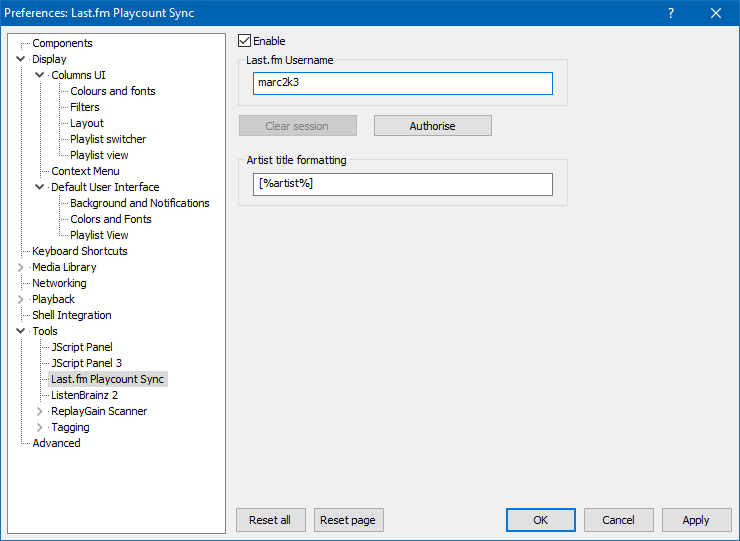
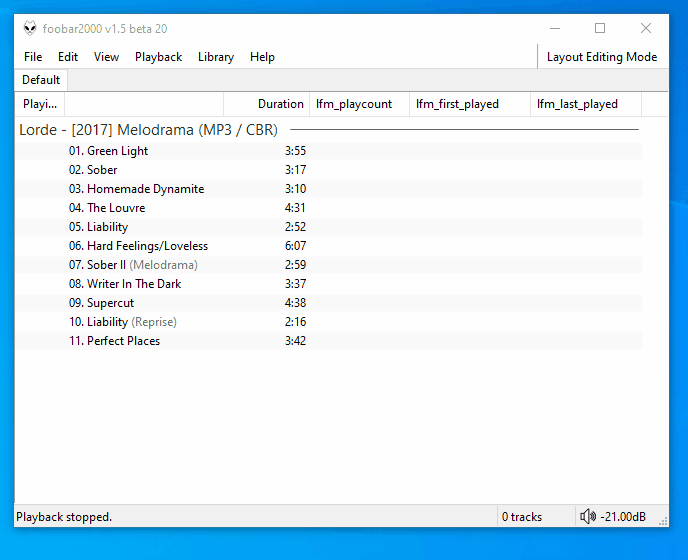
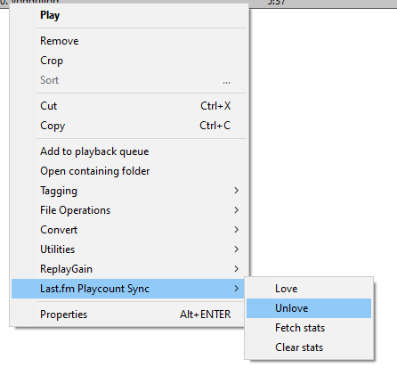

## Last.fm Playcount Sync

[](https://github.com/marc2k3/foo_lastfm_playcount_sync)

### Download

[https://github.com/marc2k3/foo_lastfm_playcount_sync/releases](https://github.com/marc2k3/foo_lastfm_playcount_sync/releases)

It's recommended that you use this in conjunction with [foo_scrobble](https://github.com/gix/foo_scrobble).

### Minimum requirements

`Windows 7` and [foobar2000](https://foobar2000.org) `v1.4`.

### Installation

[https://wiki.hydrogenaud.io/index.php?title=Foobar2000:How_to_install_a_component](https://wiki.hydrogenaud.io/index.php?title=Foobar2000:How_to_install_a_component)

### Preferences

Open `File>Preferences>Tools>Last.fm Playcount Sync` and enter your [Last.fm](https://last.fm) username.



If you're only interested in updating `Playcounts` or importing `Loved` tracks, you can ignore the `Authorise` button.

You only need to use that if you want to `love` or `unlove` tracks. When clicked, it will launch a browser window opening the [Last.fm](https://last.fm) website and you must grant permission `BEFORE` clicking the additonal confirmation dialog spawned by the `Preferences`. When `Authorisation` is complete, you should receive final confirmation. If you revoke permission or change your password on [Last.fm](https://last.fm), you'll need to use the `Clear session` button and `Authorise` again.

As of `1.0.0-Beta.6`, you can now customise the `Artist` title formatting used when looking up playcounts or `loving`/`unloving` tracks. Note that this does not change the underlying database storage mechanism which is always bound to `%artist%`. Also, it will have no effect on `loved track imports`. For technical reasons, matches can only be against `%artist%`.

### Updating playcounts

Simply listen and it will update in real time. A lookup is performed a few seconds after playback starts and assuming the server response is valid, all existing values for that track will be overwritten by [Last.fm](https://last.fm) data. Server values always take precedence! 

When you've listened to enough of a track for a count to scrobble, the playcount is incremented by one and the last played date is set. This is the only time data is written without contacting [Last.fm](https://last.fm) because most scrobblers won't submit until after the track has finished.

If you can't wait to listen your tracks normally, you can batch import up to 100 tracks at a time... just like this.



Like [foo_playcount](https://www.foobar2000.org/components/view/foo_playcount), it uses a database for storage so no file tags are touched. Stats are grouped by `%artist% / %title%` with absolutely no consideration for album tags. This generally means the numbers will match anything you see on Last.fm track pages/charts.

The field names are:

```
%lfm_playcount%
%lfm_first_played%
%lfm_last_played%
```

### Loving / unloving tracks

The database uses the following field:

```
%lfm_loved%
```

It has a value of `1` for tracks that have been loved succesfully. You can `Love` or `Unlove` by right clicking a track (or selection up to 20 tracks) and using the appropriate menu item. You may consider binding buttons or keyboard shortcuts.



Note that values are only updated on a successful response from [Last.fm](https://last.fm).

### Importing Loved Tracks

To do this, simply use the main menu `Library>Last.fm Playcount Sync>Import Last.fm loved tracks`. Matches will be made against tracks that are monitored as part of the `Media Library`. Check the `Console` for full results. Note that matches are made against `%artist%`. It's not possible to support custom title formatting here.

### Errors

Any `Authorisation` errors are reported by popup dialogs. Any errors updating playcounts, importing loved tracks or loving/unloving tracks are reported in the `Console`.
