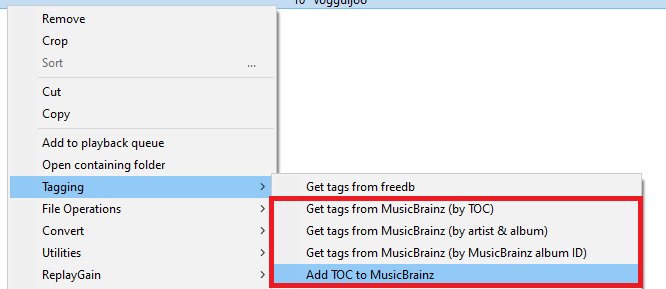

# Note: This repo has been deleted, and this information is listed for archival purposes only

## MusicBrainz Tagger

### Download

[https://github.com/marc2k3/foo_musicbrainz/releases](https://github.com/marc2k3/foo_musicbrainz/releases)

### Minimum requirements

`Windows 7` and [foobar2000](https://foobar2000.org) `v1.4`.

### Installation

[https://wiki.hydrogenaud.io/index.php?title=Foobar2000:How_to_install_a_component](https://wiki.hydrogenaud.io/index.php?title=Foobar2000:How_to_install_a_component)

### Tag Mapping

Before you consider using this to tag your files, it's important to note that it does not strictly adhere to the `Picard` tag mappings as documented here. 

[https://picard.musicbrainz.org/docs/mappings/](https://picard.musicbrainz.org/docs/mappings/)

If compatibility with `MusicBrainz Picard` or other taggers/players that make use of `MBID` data is more important then you should probably avoid using this. More details of what this component does and why can be found [below](#the-nerdy-stuff).

### Preferences

These can be found under `File>Preferences>Tools>MusicBrainz Tagger`.

### Usage

This is very much a `dumb` tagger. You can only tag complete `releases` (or release [mediums](https://musicbrainz.org/doc/Medium)) and all tracks must be in the same order as they appear on [MusicBrainz](https://musicbrainz.org). Tagging multi-disc releases in one go is possible but only when they are complete. If you only have parts, for example 2 discs out of 3, you'll need to update each disc individually.

You can right click any selection of tracks from a playlist or library viewer and use one of these 4 commands.

The `TOC` options only appear if the selected tracks are sourced from a CD rip. This is determined by their exact length so if you've used an inferior CD ripper like `Window Media Player`, your CD rips may not have these options.

The first option looks up releases by a `discid` calculated from the combination of track count/lengths. If no matches are found, it's possible the `release` does exist on `MusicBrainz` but no one has attached a `discid` just yet.

You can use the 2nd option to search for releases by `Artist` and `Album` name.

The 3rd option will let you do a more precise search by `MusicBrainz Album ID` if you know exactly which release you want to use or if you've tagged the files before, an existing value will be read.

You may paste full release URLs in to the popup dialog and the website will be stripped away leaving the MBID like this:

Example url: [https://musicbrainz.org/release/aec16b36-7dd7-4b37-842a-1376a7e3dc5a](https://musicbrainz.org/release/aec16b36-7dd7-4b37-842a-1376a7e3dc5a)

When one or more matching `releases` have been found, you'll be presented with the main `Tagger Dialog`.

From here, you can choose the best match for your selection. Note that while multiple releases may match your selection count, they may have differing track orders and entirely different tracks depending on region. Sometimes, the `release` from your country of origin may be the `worst` match and you'll have to pick another! The `releases` list is read-only but you can edit all other text fields and the `Title` column in the track list.

Note that the `Disc Subtitle` is only present for multi-disc releases and you can only edit the entry for track 1 of each disc. Edits will be applied to all tracks when tagging.

### TOC submissions

You should only use the `Add TOC to MusicBrainz` option if you are a [MusicBrainz](https://musicbrainz.org) editor and the selection is an actual `CD` in the drive. Submitted `discids` must be calculated from sources that take `pregap` information in to account. This simply is not present in ripped files.

### The Nerdy Stuff

When it comes to tagging `MBID`s, this component always follows the naming conventions used for `Vorbis` comments regardless of the underlying file format/tagging sheme.

For example, it will write `MUSICBRAINZ_ARTISTID` instead of `MUSICBRAINZ ARTIST ID` to `mp3` and `m4a` files. Repeat that for all tags prefixed with `MUSICBRAINZ`.

The following differences affect `id3` tagging only:

- `DISCSUBTITLE` is written to `TXXX:DISCSUBTITLE` rather than `TSST (SET SUBTITLE)`
- `LABEL` is written to `TXXX:LABEL` rather than `TPUB (PUBLISHER)`
- `MEDIA` is written to `TXXX:MEDIA` rather than `TMED (MEDIA TYPE)`
- `MUSICBRAINZ_RECORDINGID` is written to `TXXX:MUSICBRAINZ_TRACKID` rather than `UFID://musicbrainz.org ` 
- `RELEASECOUNTRY` is written to `TXXX:RELEASECOUNTRY` rather than `TXXX:MUSICBRAINZ ALBUM RELEASE COUNTRY`

For `Vorbis` comments only, `ORIGINAL RELEASE DATE` is written in place of `ORIGINALDATE`.

The whole purpose of this is to unify tag display/search across `foobar2000` regardless of file format. It's easier to search for `%LABEL% IS blah` rather than `%LABEL% IS blah OR %PUBLISHER% is blah` which is what you'd have to do if this was `Picard` compatible.

Obviously this comes at the expense of potentially breaking compatibility with other taggers/players that expect this data to be written in a certain way.

One last thing... none of this behaviour is new. It was all inherited from the original component by [Dremora](https://github.com/Dremora).
